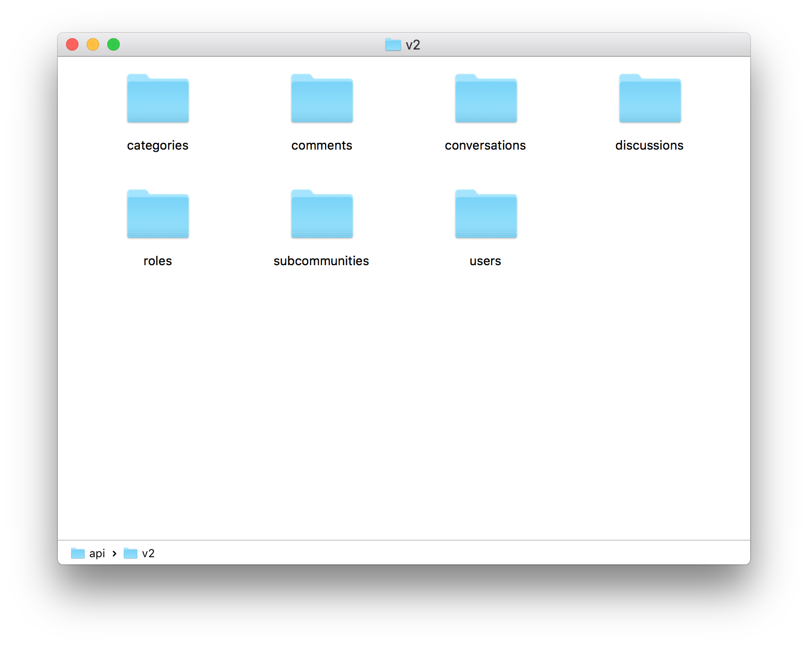
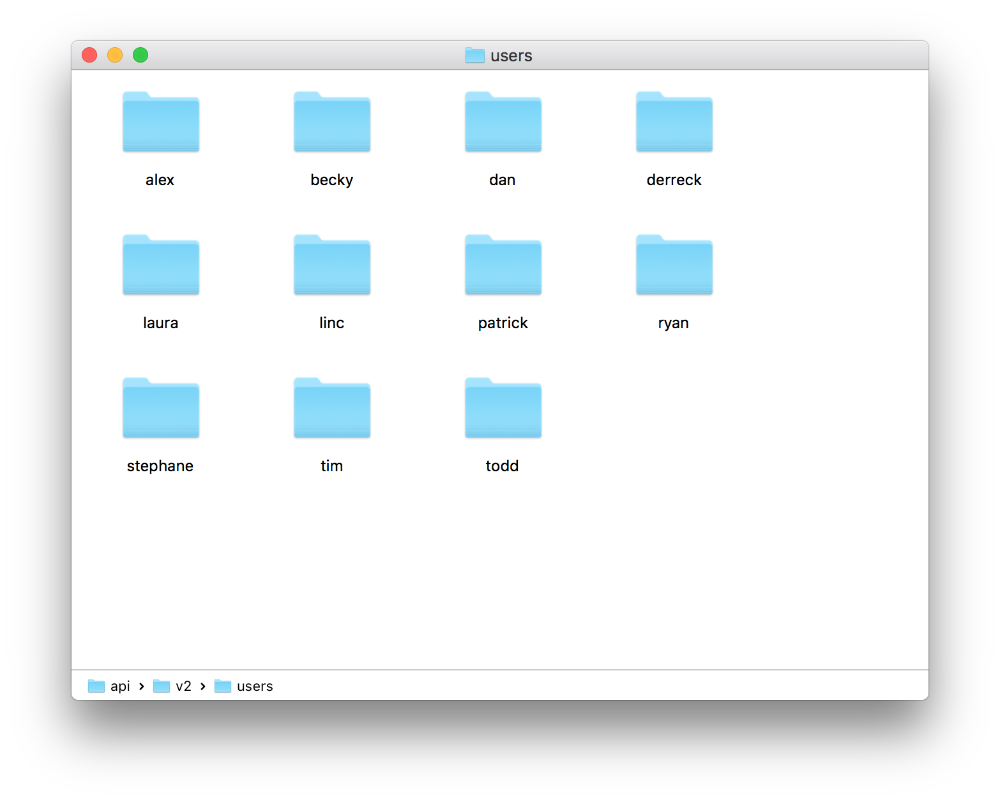
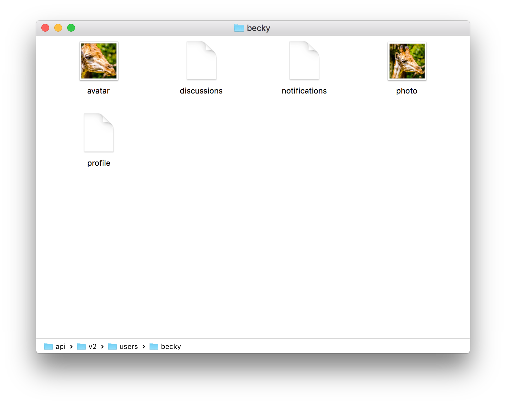

footer: © 2016 Vanilla Forums
slidenumbers: true

# [fit] Dispatcher Enhancements
## [fit] Dispatcher Enhancements Planned to Support APIv2

---

# Current Dispatcher

The current dispatcher supports basic RPC-style calls.

```
/home/hello/todd
```

**Dispatches To:**

```php
class HomeController {
    public function hello($name) {
    }
}
```

---

# RESTful Endpoints

- Controllers represent resources.
- Make use the the HTTP method for basic actions on the resource.
- Meant to make database resources mimic a filesystem.
- RESTful APIs are closely tied to the HTTP protocol.

---

## RPC Endpoint vs. RESTful Endpoint

**RPC Way:**

```
/discussions/list
/badges/add
/users/get?UserID=123
/users/edit?UserID=123
/users/photo
```

**RESTful Way:**

```
GET /discussions
POST /badges
GET /users/123
PATCH /users/123
PUT /users/123/photo
```

---

# RESTful APIs put the Record ID First

```
/users/username/notifications
```

instead of

```
/profile/notifications/username
```

---

# Example



---

# Example: /users



---

# Example: /users/becky



---

# Vanilla's RESTful API support

- Add parameters to Controller->init().
- Add HTTP method prefixes to controller methods.
- Allow controllers act more like models.

---

# Add parameters to Controller->init()

- Adding a parameter allows you to fetch a global record.
- Parameters in `init()` appear directly after the resource name.

```php
// Add /users/id support with init.
class UsersController {
    public function init($id = null) {
        $this->setUser(Gdn::userModel()->getID($id);
    }
}
```

---

# Add HTTP method prefixes to controller methods.

- The basic HTTP methods will be recognized in controller methods.

```php
class UsersController {
    // GET /users/id
    public function get() {
    }
    
    // POST /users/id/picture
    // The underscore says it's an HTTP method.
    public function post_picture() {
    }
    
    // Old way supports all methods.
    public function notifications() {
    }
}
```

---

```html
<form action="/discussions">

<form action="/discussions/id">
    <input type="hidden" name="x-method" value="PATCH" />
```

---

# Allow controllers to act more like models.

- A controller that returns an array or data set will render that as data.

```php
class UsersController {
    public function init($id = null) {
        $this->setUser(Gdn::userModel()->getID($id);
    }
    
    public function get() {
        return $this->getUser();
        // Equivalent to:
        $this->Data = $this->getUser();
        $this->render();
    }
}
```

---

# Other Goodies

- Constraints on parameter names to remove ambiguities in optional init() parameters.
- The dispatcher knows that the `index()` method is called instead of GET when the init parameters are not passed.
- Something that looks like a file extension in the URL will always be interpreted as a file extension. (Fixes /profile.json/username)
- Support JSON POST data in core.
- The dispatcher will throw appropriate MethodNotAllowedException.

---

# Conventions

- Resource controllers should be plural.
- API endpoints don't worry about SEO friendly URLs.
- Views should start putting the resource they post to explicitly, rather than assuming the current URL.
- Try and solve problems with just the basic HTTP methods rather than using underscored methods.
- We want to implement the full range of methods on resources, even if the UI doesn't call them.