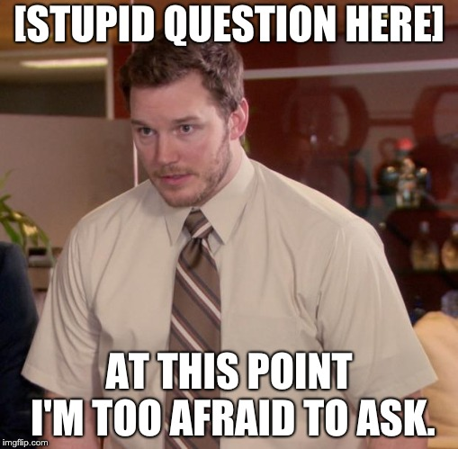

# Lunch-n-Learn

---

### Weekly informal talks about technical subjects.

## Two Objectives

---

##  1) Lunchin'

--- 
 
## 2) Learnin'

^ Short technical talks by developers (mostly) for developpers but if Sales and/or Marketing people want to participate, feel free.

^ I appreciate Mel's short talks during the Monthly meeting where she explains the mechanics and jargon of the marketing process.

^ Today we will talk about Single Sign On and Adam will talk to us about the build process.

^ Future talks could be about deepening our understanding about topics already covered or about other technical issues.

^ Future talks: Technical talks about programming, Aspects of the product, Derz could give a talk about how to fix the fridge.

^ Open to suggestions.
 
---

---

Let's keep it fast, light, and interesting.