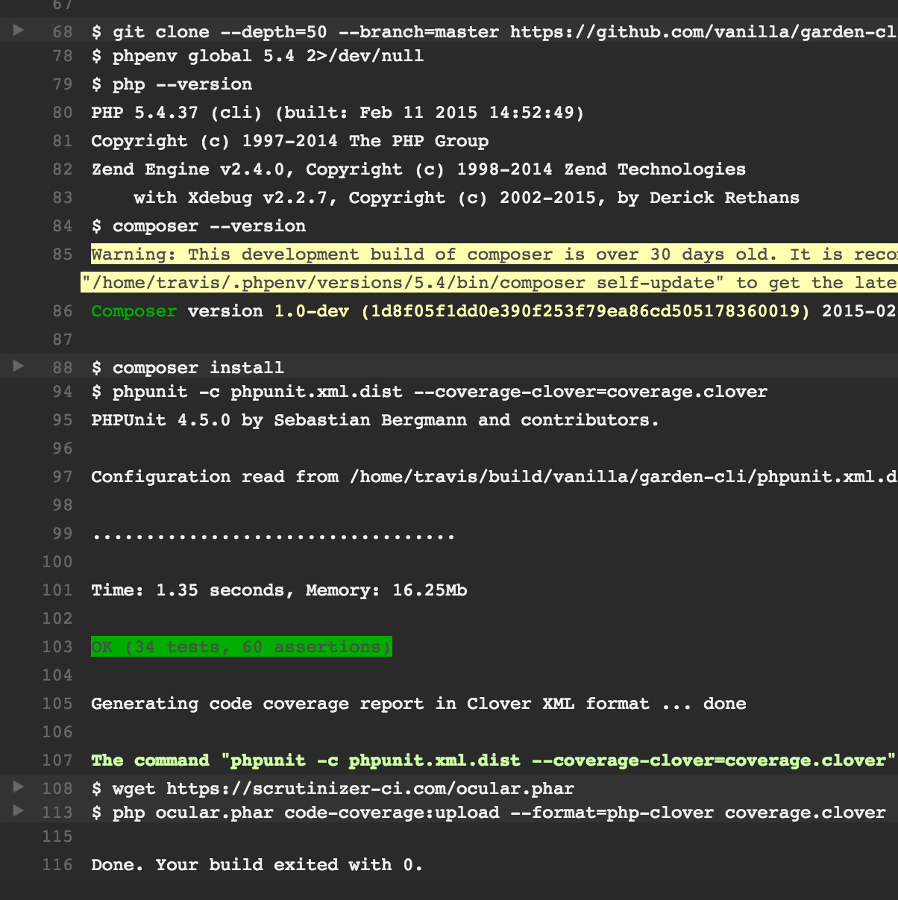
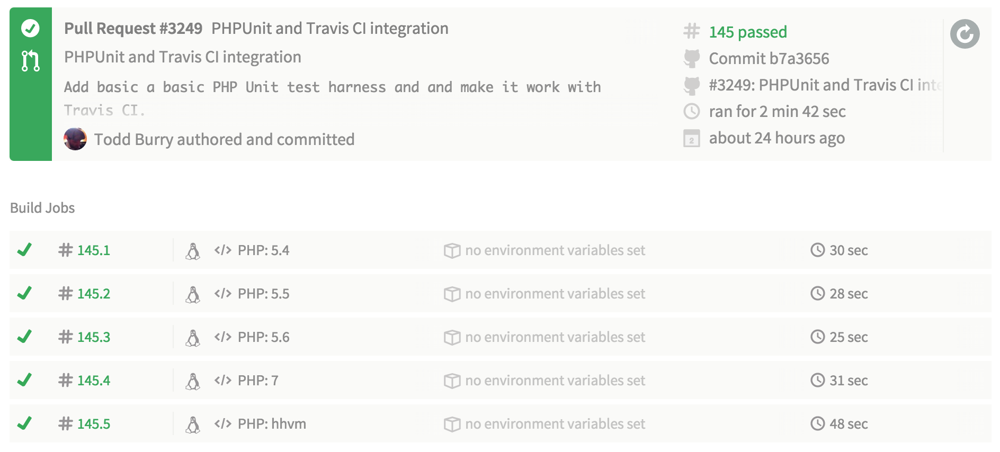
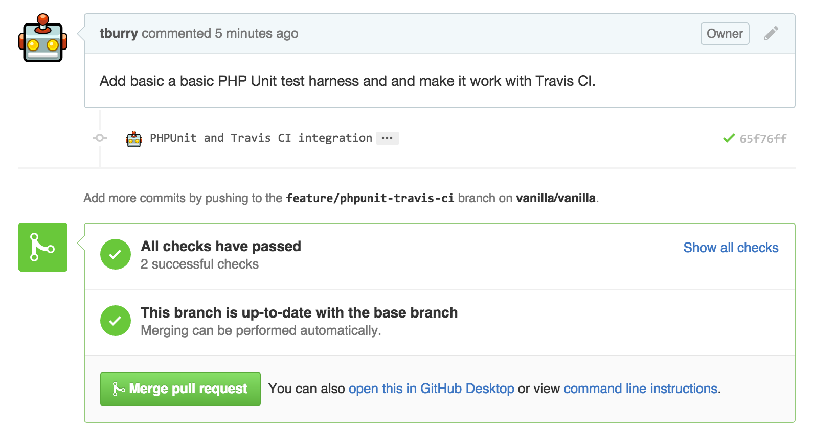
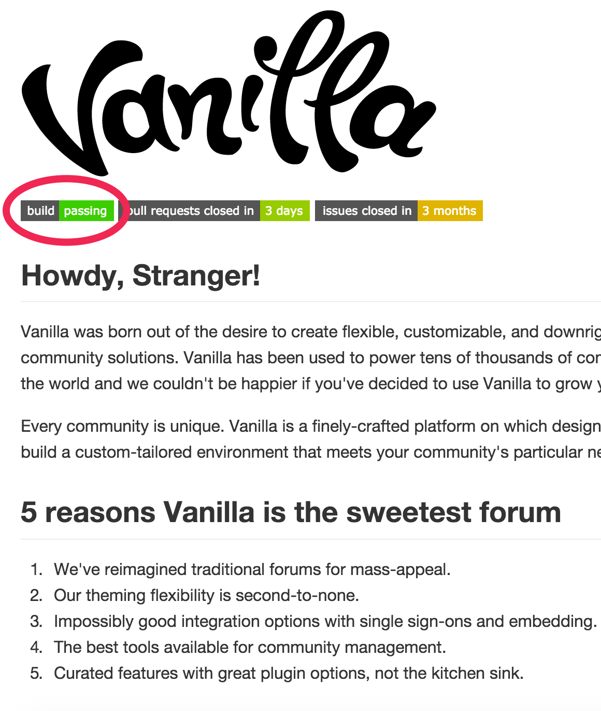

# [fit] PHPUnit and Travis CI

## [fit] Automating Testing in Vanilla

---

# What We'll be Talking About

* **PHPUnit** is a testing framework used to write automated tests.
* **Travis CI** is a continuous integration site that runs unit tests for every push to Github.

---

# Why Automated Tests are Good

* Testing with computers is cheaper than testing with humans.
* Automated tests allow us to test new code for regression bugs because every test we write can be reused over and over again.
* We gain confidence to refactor our code because we know there are a body of tests to make sure our changes are safe.
* *With good automated testing our codebase gains quality over time instead of losing it.*

---

# Types of Tests

* **Unit Tests** test a specific use-case for a single function/method. Methods will each generally have several unit tests.
* **Integration Tests** combine code tested by unit tests to make sure they work together.
* **Functional Tests** check to make sure specific features are correct by comparing results against a specification.
* **Acceptance Tests** make sure that software fulfills customer requirements.

---

# Getting Started with PHPUnit

* Install PHPUnit.
* Write some unit tests.
* Run PHPUnit from the command line or your IDE.

---

# Writing Unit Tests

* Create a subclass of `PHPUnit_Framework_TestCase`.
* Write methods that start with the word `test`.
* Write assertions within test methods.

```php
class TypeFunctionsTest extends \PHPUnit_Framework_TestCase {
    /**
     * Test {@link force_bool()} with truthy values.
     */
    public function testForceBoolTrue() {
        $this->assertTrue(force_bool(true));
        $this->assertTrue(force_bool(1));
        $this->assertTrue(force_bool('1'));
    }
```

---

# Dependencies

Use the `@depends` tag to make a test depend on another test.

```php
/**
 * Test {@link Db::insert()}.
 *
 * @depends testCreateTable
 */
public function testInsert() {
    $db = self::$db;

    $user = $this->provideUser('Insert Test');
    $userID = $db->insert('user', $user);

    $dbUser = $db->getOne('user', ['userID' => $userID]);
    $this->assertEquals($user, array_intersect_key($dbUser, $user));
}
```

---

# Data Providers

Use the `@dataProvider` tag to test a single unit test against different data.

```php
/**
 * @dataProvider provideSomeStrings
 */
public function testBase64UrlEncodeDecode($str) {
    $encoded = base64url_encode($str);
    $decoded = base64url_decode($encoded);

    $this->assertEquals($str, $decoded);
}

public function provideSomeStrings() {
    return [
        ['Hello World!'],
        [123],
        ['Iñtërnâtiônàlizætiøn'],
        [json_encode(['foo' => 'bar'])],
        [openssl_encrypt('Hello World!', 'aes-128-cbc', 'password123')]
    ];
}
```

---

# Special Methods

* The `setUp()` method will be called before every test.
* The `tearDown()` method will be called after every test.
* The `setUpBeforeClass()` method will be called before the first test of a class.
* The `tearDownAfterClass()` method will be called after the last lest of a class.

---

# Putting PHPUnit Tests into a Project

* All unit test files are usually put in a `/tests` directory.
* Unit test classes should follow psr-4 naming convention.
* Unit test classes are added to the composer.json's `autoload-dev` section.
* The phpunit.xml.dist tells PHPUnit where everything is.

---

# Let's Talk about Continuous Integration Now

* Continuous integration ensures tests are always run.
* A good CI application lets us test our code against different versions of software.
* Pull requests can be prevented from being merged if they fail their tests automatically.
* Seeing a history of passing tests helps show that our software is robust.

---

# How Travis CI Works



* A web-hook tells Travis whenever code is pushed.
* Travis clones the repo and looks for a `.travis.yml`.
* Travis builds the project and then runs test scripts.
* *Travis CI* just runs command line scripts. Anything that can be scripted can be run inside Travis CI.

---

# A Sample Build in Travis CI



---

# Travis CI Integrates with Github



---

# Getting Started with Travis CI

* Add a `.travis.yml` to the root of your project.
* Sign in to Travis CI and link your project.
* Add a web-hook in the Github settings of your project to notify Travis CI. 

---

# Vanilla's Unit Testing Plan of Action

* Don't be concerned about nomenclature. Go ahead and call everything a unit test.
* Write some basic tests against our own API.
* Add new tests to reproduce bug reports before fixing.
* Write unit tests before refactoring a core object/method.

---

# Don't Break the Build



* Keep an eye on your PRs to make sure they pass tests.
* Write some tests to help you with your PR logic.
* Watch for test writing tasks to be assigned to you in coming sprints.
* Read the documentation for [PHPUnit](https://phpunit.de/manual/5.0/en/index.html) and [Travis CI](http://docs.travis-ci.com/).

---