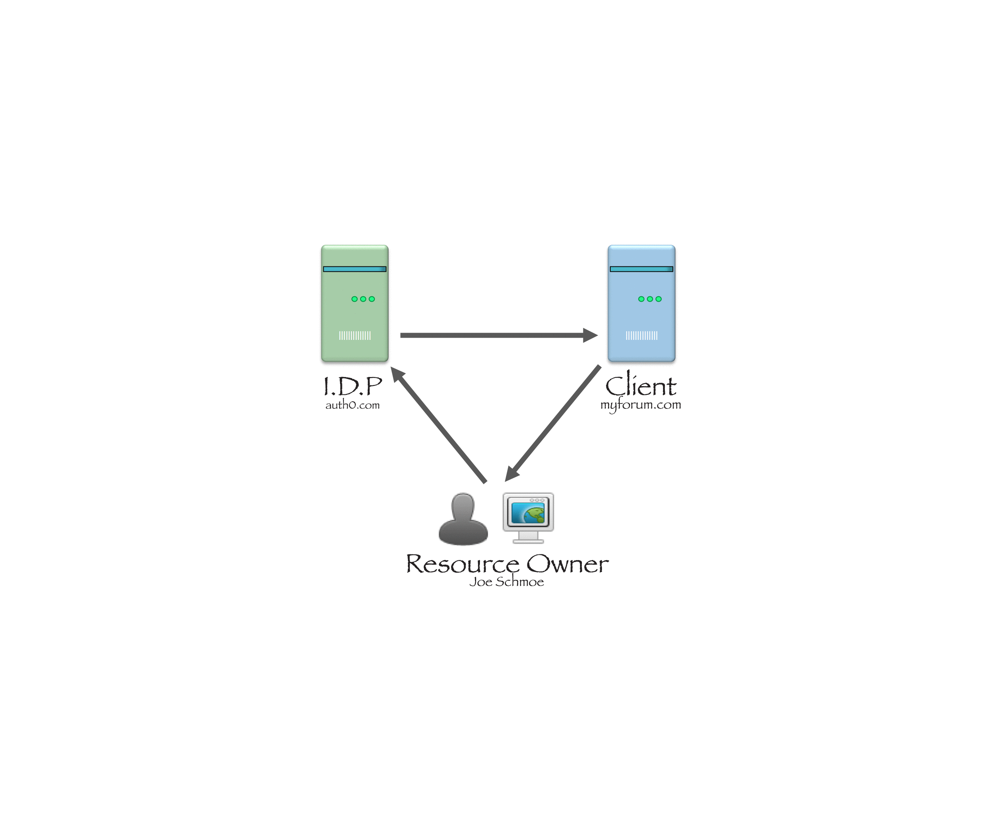

# SSO Overview

---

## What is SSO?

SSO is any *framework* of access control where a user logs in with a single ID and password to gain access to a connected system or systems without using different usernames or passwords, or in some configurations seamlessly sign on at each system.

---

## Players and Positions

--- 

## Players and Positions


### Client:

The system that is asking another system for access to a user's info. In other words a Vanilla Forum. 

*myforum.vanillaforums.com*

---
## Players and Positions (cont'd)

### Resource Owner:

The "resource" is the user's personal data. The person trying to sign in is the Resource Owner. 

*Joe Schmoe*

---
## Players and Positions (cont'd)

### Resource Server or Authorization Server or Identity Provider (IDP):

The server that holds the Resource Owner's personal User Data. 

*auth0.com*

---

## How it works

**Resource Owner** (*Joe Schmoe*) is visiting **Client** (*myforum.vanillaforums.com*). 

---

## How it works

He decides he wants to post a comment. He clicks on "Sign In". He is redirected to **IDP (Resource Server)** (*auth0.com*) where he is asked for his **User Name** and **Password**. 

---

## How it works

After entering his **User Name** and **Password** he is sent to an intermediary page that asks him "**Do you want to give *myforum.vanillaforums.com* access to your email address?**". 

---

## How it works
He clicks "**Yes**" and is redirected to **Client's** connection endpoint (*myforum.vanillaforums.com/entry/oauth2*) which creates a User for him and logs him in.

---

## So Simple

---



---

### What could go wrong?

---

## SSO methods at Vanilla

 * OAuth2
 * SAML
 * JSConnect, VanillaConnect
 * JASON Web Token
 * Facebook, Google, LinkedIn, etc.
 
---

## What is common about all these methods?
### With a few exceptions all: 

 * Can be used in conjuction with the Vanilla Sign In method or as "Default".

---
### all: 

 * Store configuration data in Gdn_UserAuthenticationProvider:
 	* A unique AuthenticationKey to access the configuration data for that specific set up.
 	* An AuthenticationSchemeAlias to designate the SSO method (e.g. SAML, OAuth2, JSConnect).
 	* A RegisterURL, a SignInURL.
 	* Most store an AssociationSecret (either a random hash or, in the case of SAML, a Certificate).

---
### all: 

 * Send the user to the configured Sign In URL.

---
### all: 

 * Pass the TargetURL throughout the connection process to return the user back to where he initiated the Sign In process.

---
### all: 
 * Contain methods `entryController_[AuthenticationSchemeAlias]_create` and `base_connectData_handler`.

---
### all: 
 * Redirect back to `/entry/[AuthenticationSchemeAlias]`.

---
### all: 
 * Redirect (directly or indirectly) or post to `/entry/connect/[AuthenticationSchemeAlias]` from `/entry/[AuthenticationSchemeAlias]`.

---
### all: 
 * Store connected users to `Gdn_UserAuthentication` with the unique identifier sent from the IDP.

---
### all: 
 * Connect the User to an existing user or create a new one by:
 	* Checking if the unique identifier sent from the IDP exists in `Gdn_UserAuthentication`.
 	* If no match is found, checking if the email sent exists in `Gdn_User`.
 	* If no match is found, creating a new user.

---

## Where all the trouble begins
### Low hanging fruit

--- 
### Problems: Client Configurations (our side).
 Some configuration issues will break the workflow.
 
 * Incorrect endpoints: 
 	* AuthenticateURL (JSConnect).
  	* AuthorizeURL (OAuth2).
  	* ProfileURL (OAuth2).
 	* http vs. https vs. www 
 * OAuth2 client can (*mis-*)configure the JSON array keys carrying profile data.
 
---

### Problems: Client Configurations (our side - cont'd).
 Some configuration settings will just produce unforeseen results.
 
 * Setting an SSO method as the Default vs. not
 * `Garden.Registration.AutoConnect`
 	* FALSE by default.
 	* If a user with same email exists and he tries to log in over SSO it assumes he is that User.
 * Private communities + SSO default = Redirect to client login page.
 
---

### Problems: Client Configurations (their side).

 * Callback URLs (again http vs. https vs. custom domain).
 * In SAML and JSConnect it could be the signature.
 * SAML is extremely delicate, which is why we warn the client in the plugin.
 * Broken endpoints.

---

## Where all the trouble ends
### Trouble shooting techniques

---

## DB Logger is your friend.
### Except if it's JSConnect
 * Turn on DB Logger as soon as trouble begins.
 * OAuth2:
 	* Turn on DB Logger and set config `Vanilla.SSO.Debug` = true;
 	* Search the Event Log for Event Name "sso_logging".
 * For others search the code for "Logger" to get Event Names.

---

## Chrome Console is your friend

 * Frequently there are redirects to be traced in console.


---

## Real World Providers

 * Create accounts with Auth0.com to learn the various configurations of OAuth2 and SAML
 
---

## Use the Stub SSO Providers

 * https://github.com/vanilla/stub-sso-providers create fake local providers.
 
---

## Test Client Sites Locally

Spoof the entire workflow if you have log in credentials and set breakpoints in IDE.

 * Set your etc/host file to point the client's domain to your IP.
 * Set a config for the client's site in your config/bootstrap.before.php
 
```
   $host = $_SERVER['HTTP_HOST'];
   $host = explode(':', $host, 2)[0];
   if (in_array($host, ['community.acer.com'])) {
      $slug = 'config';
   }
```

---

## Don't be discouraged

 * By it's nature SSO is obscure:
 	* Verbose error messages would just serve hackers.
 	* Errors occur in server-to-server communication. 
 * Dealing with clients presents communication challenges.
 * We can overcome by learning and sharing our knowledge.

---

# Questions


